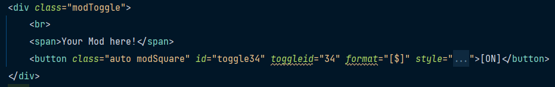

# Synergism Plus

## Modding
### Getting Started
Welcome to Synergism Plus! Here's a quick and easy to understand guide on how to get started making your own mod! 
To start simply `fork` this Repository and clone it to your local machine. 
Once you've done that open it up in your code editor of choice (preferably Visual Studio Code) and open up the Terminal. 
Once you've opened the Terminal run `npm install` to install all dependencies. This is very important, the project will not work without it!  
If you've completed all these steps you're ready to move on to the next section!

### Adding a new Mod Toggle
Congrats on completing the first section! This section will walk you through creating the Mod Toggle for your Mod! 
Let's start by adding it to `index.html` 
Head over to `index.html` line `2986`. This line begins the section of `index.html` that contains all the content in the Modifications tab. 
You should see a block of code that looks something like this:   
You're going to want to copy that entire code block and paste it beneath the last block of its type (so, if there were 3 blocks like that you'd paste it beneath the 3rd). 
This is your Mod's toggle code! You'll want to start by replacing the text in the `` element with the name of your Mod. 
We're going to be making a few changes to the `button` element. First, replace the `id` with `toggle<your Mod's Toggle Number here>`. Then replace the `toggleid` with `<your Mod's Toggle Number here>` 
Don't know what your Mod's Toggle Number is? That's ok, we'll be going over that in the next section :) 
Congratulations! You've successfully created your Mod's Toggle! Head over to the next section to learn how to give its own Toggle Number and make it a functional toggle!
Oh, and don't forget to add your Mod and a short description of it to the Mods List!

### Creating a Toggle Number and making the Toggle functional
You've almost finished setting up your Mod's Toggle! Read through this section to learn how to create a Toggle Number for your Mod and how to make the Toggle functional! 
Ok, this is where things get a bit more complex. Let's start by heading over to line `378` of `UpdateHTML.ts`. 
There you should see a list of Toggle Numbers with a comment next to them. You'll want to copy that line and paste it beneath the other Toggle Numbers. 
From there, change the number in its name to the previous Toggle Number's plus one (so, if the previous Toggle was named `"toggle35"` you'd name yours `"toggle36"`) and change the comment to say `//Settings - Mods - <your Mod's name here> Toggle` 
Now head over to `Synergism.ts` line `269`. There you should see a array of all the Toggle Numbers. Simply add your Toggle Number to the bottom of the array! 
Last but not least head over to `EventListeners.ts` line `191`. There you should see a `for` loop. Simply change the second number in the `for` loop to whatever it was plus one (so, if it was a 35 you'd change it to a 36)! 
Congratulations! You've now created a fully functional Mod Toggle! If you didn't already, go back to your code block in `index.html` and fill in your Toggle Numbers.

### Running your Mod locally
Running your Mod locally only takes 3 simple steps! 
1. Open up `index.html` in your browser of choice.
2. Go back to your code editor, open the terminal and run `npm run build:esbuild`.
3. Go back to your browser and refresh the page.

Your Mod should now be running locally! If you make a update to your Mod but still have the page open simply repeat steps 2 and 3 to see all your new changes.

### Coding your Mod
This is the part where I have to leave you to your own devices. 
From here you can venture into the code and modify whatever you please, just be careful to fix any errors that you may cause! 
Important: Make sure whatever effect your Mod has only runs when the toggle is enabled. Thanks :) 
Have fun!

### Adding your Mod to Synergism Plus
Are you finished with your Mod and ready to share it with the world? Here's a simple guide on how to do that! 
First, be sure there are no errors. No Mods that cause errors will be added, sorry. (this does not include errors that are caused by conflicts with other Mods) 
Then simply create a PR (pull request) to the Synergism Plus repo, I'll merge it as soon as I see it :)

